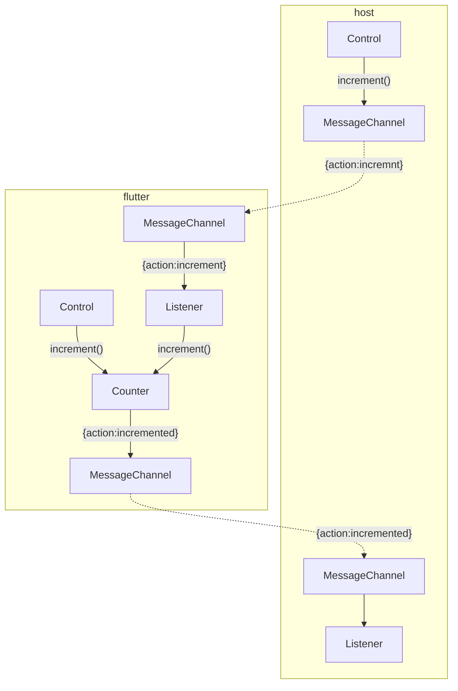

# Embedded Flutter application communication with parent application

These examples show communication between the Flutter Application and the host / native application via _message channels_.  The same Flutter code is used for all three embeddings with a minor switch statement for Web communication.

## Flutter Channel types

There are three native platform channel types.  V1 of this application uses the `Message Channel`

| Channel type and Flutter class                                                                 | Description                                           | Flutter to Native | Native to Flutter | Supports Return  |
| ---------------------------------------------------------------------------------------------- | ----------------------------------------------------- | ----------------- | ----------------- | ---------------- |
| [MethodChannel](https://api.flutter.dev/flutter/services/MethodChannel-class.html)             | Invoke method on the other side                       | Yes               | Yes               | Yes via `result` |
| [EventChannel](https://api.flutter.dev/flutter/services/EventChannel-class.html)               | Creates a stream. Updates can flow in both directions | No                | Yes               | Bidirectional    |
| [BasicMessageChannel](https://api.flutter.dev/flutter/services/BasicMessageChannel-class.html) | Encode and decode using a codec.  No parameters       | Yes               | Yes               | Yes via `reply`  |

## Documentation on platform specific implementations

Additional details are available for each platform implementation

| Platform                                                                                        |
| ----------------------------------------------------------------------------------------------- |
| [Web application with message communication between Flutter and Web](README_WEB.md)             |
| [Android application with message communication between Flutter and Android](README_ANDROID.md) |
| [iOS application with message communication between Flutter and Android](README_IOS.md)         |

## V1

This is the _shortest path_ with as little code as possible.

1. Flutter fills up the entire screen for the iOS and Android applications.  There are no native controls to generate the increment messages
2. This uses a classic single channel specifying the action in a field in the JSON.  Native applications typically do one message per channel and have one channel for each message type
