# Demonstrating embedding a flutter app in an iFrame or via element replacement

Sometimes you want to do an incremental migration from your existing web patter to flutter.
Or you are adding some flutter capability to an existing web application.
This means that you want to run flutter _inside_ or _inserted_ into an existing web application.

## V1

This simulates a dual site by running two web servers, one representing the old site and the other representing the new flutter based web application or component.

```mermaid
graph TD
  subgraph 4001[Static Site : 4001]
    subgraph staticIndex[index.html]
      elementLoad[[Javascript: element FLUTTER_DIV_ELEMENT onload<br/;>loads 4002:index-embedded.html]]
      messageReceive[[Javascript: Message Receive<br/;>pointed at MESSAGE_RESULTS_DIV]]
      iFrame(iFrame <br/;> loads 4002:index.html)
      elementFlutterDiv(element FLUTTER_DIV_ELEMENT)
      elementMessage(element MESSAGE_RESULTS_DIV)
    end
  end

  subgraph 4002[FLutter Site : 4002]
    subgraph flutterIndexEmbedded[index-embedded.html]
      flutterIndexLoadEmbedded[[Javascript: load Flutter app<br/;>Replace FLUTTER_DIV_ELEMENT]]
    end
    subgraph flutterIndex[index.html]
      flutterIndexLoad[[Javascript: load Flutter app<br/;>Replaces iFrame root]]
    end
    subgraph flutter[Flutter Application]
      counter[[Increment counter]]
      flutterPostMessage[[Post Message<br/;>to Window]]
    end
  end

  elementLoad-.loads.->flutterIndexLoadEmbedded
  iFrame-.loads.->flutterIndexLoad
  messageReceive--appends-->elementMessage

  flutterIndexLoad-.loads and starts.->flutter
  flutterIndexLoadEmbedded-.loads and starts.->flutter
  flutterIndexLoadEmbedded-.replaces.->elementFlutterDiv
  counter-->flutterPostMessage
  flutterPostMessage--postMessage-->messageReceive

  classDef orange fill:#421,stroke:#333,stroke-width:2px;
  classDef green fill:#243,stroke:#333,strong-width:2px;
  class staticIndex,flutterIndex,flutterIndexEmbedded orange
  class flutter green

```



* 4001 - represents the existing web site and holds only static content for the example
  * index.html - loads localhost:4002 two ways,
    * as an iFrame via loading the flutter_applications `index.html`
    * as an element replacement via a loading the flutter_application's `index-embedded.html`.  The element id is `FLUTTER_DIV_ELEMENT`.
* 4002 - represents the new flutter web site. The flutter app is on the root.
  * index.html - standard flutter
  * index-embedded.html
    * hard coded to replace an HTML element called `FLUTTER_DIV_ELEMENT` with the flutter app engine
    * hard coded to know the server it is running on `base`.
  * index-embedded-query.html - not used
    * originally intended to work with a query string to programatically replace a field by name. Retained for future work

## base href

The key to making this work is setting the flutter `base` `href` to the server that the flutter app is running on.
This changes the way flutter creates the URLs used to fetch resources.  The default value inserted at flutter build time is `/`.
You can change the value as part `flutter build web --base-href "http://localhost:4002/"`.

### base href flutter-embedded.html

This runs the same flutter app as an iframe and inside the element tree.
The standard _Flutter_ created `index.html` works fine for standalone.
Running in a div requires several changes to the Flutter template created `index.html`

1. Add a query to find the element that is being replaced
1. Change the way flutter is loaded in `window.addEventListener('load', function(ev)` and have it replace the element found above.
1. Change the base href that tells Flutter how to access additional resources

`index-embedded.html` is used when embedding.  It was created by copying `index.html` instead of modifying `index.html`.
This lets us run in either mode by selecting the appropriate html file and lets developers compare the two for differences.
Applications that _only_ run inside an element may chose to update `index.html` and set the `base` at build time using standard flutter tooling

* Note: `index-embedded.html` isn't part of the normal "build web" process so it is hard coded to set the `<base href>`.

The hard coded value in `index-embedded.html`.

```html
  <base href="http://localhost:4002">
```

## Demonstrate communication from Flutter to the hosting web page

This program demonstrates Flutter to Javascript communication. It notifies the wrapper via `postMessage()`. The example can be modified for ReactJS or other web frameworks.

A message is sent from the counter to static HTML page hosting both the iFrame and the replaced element.  The embedding HTML page has a Javascript handler that logs received events to a text area in the main page and to the console.

1. For the element replacement, the launch HTML is the same window the element is in.
   1. This shows up as a location of `http://localhost:4001` in the demo in the HTML and the javascript console. This is the static content's location.
1. For the iFrame, the launch HTML is the **parent** window.
   1. This shows up as a location of `Instance of 'minified:a0p'` in the demo in the HTML and the javascript console.
1. For the iFrame, a message is sent into the index.html wrapper that launches flutter.
   1. This shows up as a location of `http://localhost:4002` in the demo.  This is the address of the web server that holds the Flutter application.
   2. We don't see any received message because the Flutter boilerplate HTML has no handler and should stay that way in most places.

## TODO

* Demonstrate message channel communication from the web site to the Flutter Application
* Look at ways of eliminating 'unsafe-inline' and 'unsafe-eval' in ContentSecurityPolicyOptions in `server.dart`.  Left in for now to simplify.
