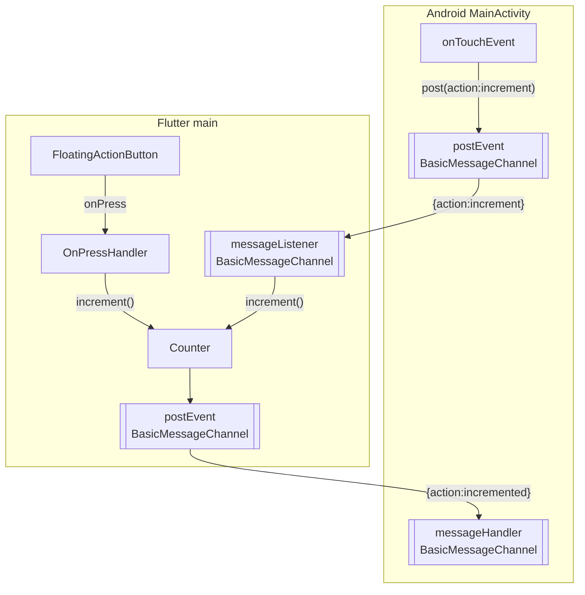
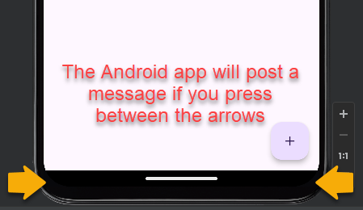

# Platform Channels

Goal: Demonstrate Communication between Android Application and embedded Flutter application

The V1 application can be run as an Android engine.

## What the app does

1. Runs a single counter Flutter application embedded in an android app
2. The Flutter application sends the `initialized` message on startup via the `BasicMessageChannel`.
   1. You can see this in the logs and in the `Toast` popup.
3. The Flutter counter application includes an `+` / `Increment` button
   1. The `increment` button increments the counter when the plus button is pressed.
4. The Android application has a `gesture` handler that can pick up any mouse down outside the flutter application.  The application doesn't run with fragments so the only gesture aware area is the area at the bottom of the emulator where the slide up bar is.
   1. The `Android` gesture handler posts an `increment` message to the the `BasicMessageChannel`
   2. The `Flutter` application listens for `increment` messages on the `BasicMessageChannel` which invokes the Flutter `increment` function.
5. Flutter sends an `incremented` message every time it increments
   1. You can see this in the logs and in the `Toast` popup.  Look for `received message:`

## Running the Android app

1. Start the android emulator from VS Code
2. (optional) Run the Android studio and open `logcat` to see the android logs
   1. It looks like the andoid debug logs are also visible in the Visual Studio Code debug console
3. Start the application in VSCode by highlighting the `main.dart` and then pressing right mouse to expose the `start debubgging` menu item.
   1. You can also use the `VSCode` run menu.  Select `Flutter` and press the run icon.
4. This should launch the application in the android emulator

## TODO

* Diagrams for the Android application
* Convert the application use Fragments and put the Flutter engine in a fragment. Add an android button that can send a message into flutter like demonstrated in the web app.
  * Currently uses no Fragments and dectects press actions outside the Flutter application
  * Fragments not implemented because the Flutter android template doesn't create them so I left this code like people would see it in a new Flutter project.
* _?_ Run two copies of the flutter code in a Fragment with a swipe operation or a scroll area or something. (links from before I understood we should use Fragments)
  * See <https://medium.com/flutter/flutter-platform-channels-ce7f540a104e>
  * See  <https://github.com/flutter/samples/tree/main/add_to_app/multiple_flutters>
  * See <https://github.com/flutter/samples/blob/main/add_to_app/multiple_flutters/multiple_flutters_android/app/src/main/java/dev/flutter/multipleflutters/DoubleFlutterActivity.kt>

## MethodChannel, EventChannel, BasicMessageChannel

The V1 version implements native communication via the `basic message channel` implemented with `BasicMessageChannel`

| Type                  | Description                                           | Flutter to Native | Native to Flutter | Supports Return  |
| --------------------- | ----------------------------------------------------- | ----------------- | ----------------- | ---------------- |
| `MethodChannel`       | Invoke method on the other side                       | Yes               | Yes               | Yes via `result` |
| `EventChannel`        | Creates a stream. Updates can flow in both directions | No                | Yes               | Bidirectional    |
| `BasicMessageChannel` | Encode and decode using a codec.  No parameters       | Yes               | Yes               | Yes via `reply`  |

References

* <https://dave790602.medium.com/introduction-to-communication-between-flutter-and-native-f746c112513d>
* <https://medium.com/@expertappdevs/how-to-write-native-code-with-platform-channel-in-flutter-033f7da4946f>

### MethodChannel

ipse lorum

### Event Channel

ipse lorum

### Basic Message  Channel

Supports a single payload using codecs like the JSON codec

ipse lorum
