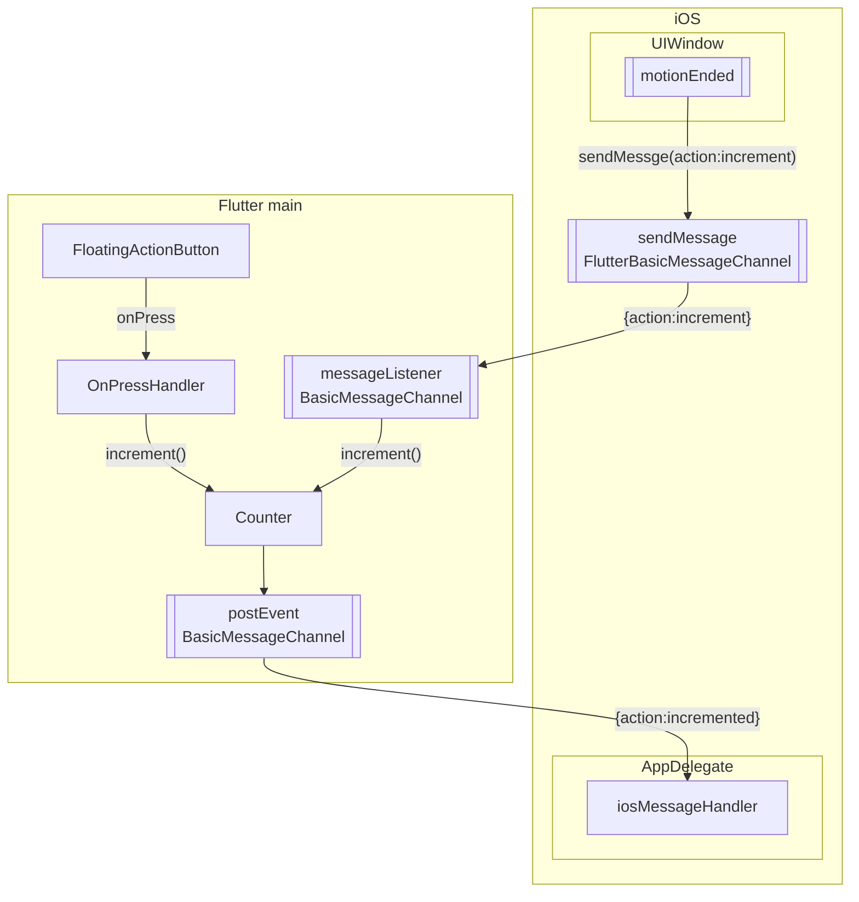

# iOS integration in this repository

Goal: Demonstrate Communication between iOS Application and embedded Flutter application

The V1 application can be run as an iOS application.

## What the app does

This currently supports bidirectional messaging whenever the counter is incremented in the Flutter module or an event is generated in the iOS program

The iOS application listens for _shake_ events so that we could use the standard Flutter template without having to partition the screen for iOS controls.

### From Flutter to iOS

1. The Flutter code posts a message to the `BasicMessageChannel` on startup
2. The Flutter code posts a message to the `BasicMessageChannel` every time the increment butotn is pressed.
3. The iOS code listens on a `FlutterBasicMessageChannel`
4. The iOS code logs received messages via `print()`.  They show up in the XCode log pane.

### From iOS to Flutter

1. **Shake** the device using `Device -> Shake`
2. The iOS code posts an `{action:increment}` message to the `FlutterBasicMessageChannel`
3. The Flutter code listens for the `{action:incremnt}` message and increments the counter.
4. The flutter code logs the received message.

## Installation Instructions

1. Install XCode
2. Add the appropriate devices configurations to the XCode simulator
3. You may need to install pods

## Runnning the iOS Simulator

1. Verify you have the target simulator loaded. This is done with XCode. You can find instructions at [adding additional simulators](https://developer.apple.com/documentation/safari-developer-tools/adding-additional-simulators)
2. Build the app in VSCode
3. Open the ios directory in `XCode`
4. Run the application
5. Verify the logs at the bottom of `XCode`

## To Do

1. In iOS, converting the received JSON string to a JSON object.
2. Diagrams similar to those for the Android version
